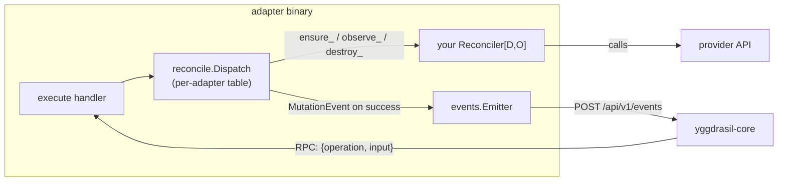
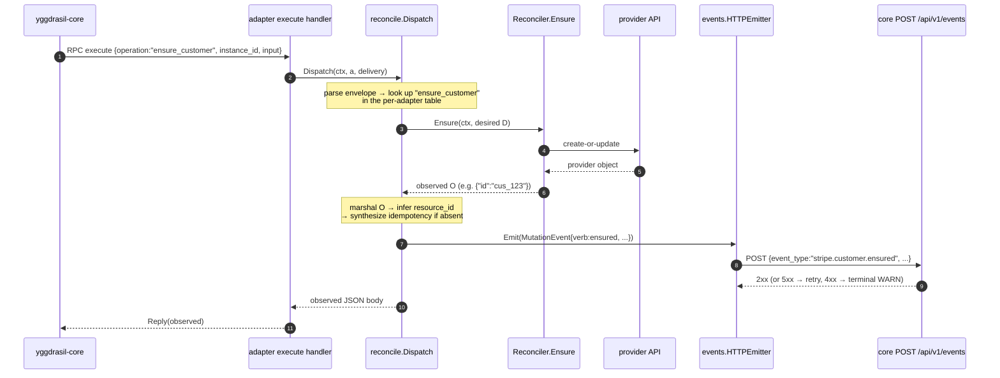

# Reconcile & Events — the `Reconciler[D,O]` + §6.5 auto-emission contract

This is the contract that lets an adapter stop hand-writing an `execute` switch
**and** stop hand-writing mutation-event emission. You implement
`Reconciler[D,O]` per managed resource; the SDK routes operator requests to the
right method and — when an emitter is wired — POSTs a `MutationEvent` to
`yggdrasil-core` after every successful `Ensure()` / `Destroy()`.

Back to the [README](../README.md) · [USAGE](USAGE.md) · [PACKAGES](PACKAGES.md).

> Verified against `sdk/reconcile/*.go` and `sdk/events/*.go` at `v0.8.5`.

---

## 1. The mental model



`RegisterReconciler` builds a per-adapter dispatch table keyed by the
`*adapter.Adapter` pointer, so multiple reconcilers on one adapter compose
without colliding.

---

## 2. The interface

```go
type Reconciler[D any, O any] interface {
    Ensure(ctx context.Context, desired D) (O, error)                        // idempotent create-or-update
    Observe(ctx context.Context, filter map[string]any) ([]O, string, error) // returns items, cursor("" = complete)
    Destroy(ctx context.Context, ref string) error                           // MUST treat "not found" as success
}
```

`D` is the desired-state payload (input to `Ensure`); `O` is the observed-state
payload (output of `Ensure`, element of `Observe`). They are usually distinct —
`O` carries provider-generated fields like `ID` that `D` lacks.

Optional sister interfaces:

| Interface | Method | When |
|---|---|---|
| `DestroyWithDesired[D]` | `DestroyWithDesired(ctx, ref, desired D) error` | destroy needs the full desired payload (credentials) — see §6 |
| `Discoverer[O]` | `Discover(ctx, scope map[string]any) ([]O, error)` | enumerate provider-side resources the adapter didn't create |
| `DriftReporter[D,O]` | `Drift(desired D, observed O) bool` | workflows that branch on drift without re-running Ensure |

---

## 3. Registration → dispatch table

```go
reconcile.RegisterReconciler(a, "customer", "customers", &customerReconciler{},
    reconcile.WithEmitter(emitter),
    reconcile.WithProvider("stripe"),
    reconcile.WithInstanceID(instanceID),
)
```

`RegisterReconciler(a, resource, resourceType, r, ...)` installs three entries
into the table for `a`:

| Operation name | Built from | Calls | Emits |
|---|---|---|---|
| `ensure_<resource>` | `"ensure_" + resource` | `r.Ensure` | `verb: ensured` |
| `observe_<resourceType>` | `"observe_" + resourceType` | `r.Observe` | nothing (read-only) |
| `destroy_<resource>` | `"destroy_" + resource` | `r.Destroy` / `r.DestroyWithDesired` | `verb: destroyed` |

So `RegisterReconciler(a, "customer", "customers", r)` →
`ensure_customer`, `observe_customers`, `destroy_customer`. `resource` /
`resourceType` are lowercased + trimmed; empty values **panic** at registration
(a programming error, surfaced loudly).

`WithLegacyNames("create_customer", ...)` adds shim entries that route a
pre-convention name to the canonical handler (chosen by verb prefix:
`create_/update_/upsert_/register_/set_/apply_/issue_` → ensure;
`get_/list_/describe_/lookup_/retrieve_` → observe;
`delete_/unregister_/remove_/teardown_/revoke_/cancel_/archive_` → destroy) and
WARN-log on each use. Removal target: SDK v0.7.0.

---

## 4. The execute → Dispatch → Ensure → emit sequence

This is the §6.5 wire end to end for an `ensure_*` request.



Key invariants (from `register.go` / `dispatch.go` / `events/http.go`):

- **No emit on failure.** If `Ensure`/`Destroy` returns an error, the SDK returns
  the error and emits nothing — the event records a fact that happened.
- **Best-effort emit.** A failed `Emit` is WARN-logged and **swallowed**; it
  never fails the capability reply. Adapter availability does not depend on the
  event bus. `Observe` never emits.
- **Emission is wired only when `WithEmitter` is passed.** Otherwise
  `RegisterReconciler` logs exactly one WARN per adapter at startup.

---

## 5. `resource_id` and idempotency — how the SDK fills them

`yggdrasil-core`'s `/api/v1/events` validator rejects (HTTP 400) any mutation
event with an empty `resource_id` or empty `idempotency`. The SDK fills both.

### `resource_id` inference (ensure path — `inferResourceID`)

Walked in order until one resolves to a non-empty string:

1. Reflect on the observed struct's `ID` / `Id` field.
2. Top-level JSON `id` / `ID` / `Id` (numeric values coerced to string — integral
   floats render as integers, not scientific notation).
3. Scoped `<resource>_id` (e.g. `customer_id`, `channel_id`).
4. Composite `{"owner":"x","repo":"y"}` → `"x/y"` (GitHub).
5. GitHub `full_name` (`"owner/repo"`).
6. Named-after-resource (`{"<resource>": "owner/repo"}`).
7. `""` — the event then 400s at the core, surfacing the gap rather than hiding it.

### `ref` inference (destroy path — `inferRefFromInput`)

Real adapters send provider-shaped destroy payloads, not `{"ref": ...}`. The SDK
scans for a ref in this order: `ref` → `<resource>_id` → `id` → `owner+repo`
composite → named-after-resource → `""`.

### Idempotency synthesis

If the inbound execute envelope carries no `idempotency`, the SDK synthesizes a
deterministic-within-a-nanosecond key:

```
<provider>.<resource>.<verb>.<resource_id>.<sha256_8_of_unixnano>
```

A retried emit within the same nanosecond hashes identically, so the downstream
`event_log` deduplicates. A caller-supplied key always wins (flows through
unchanged). The envelope's `instance_id` likewise forwards onto the event.

> This is why the destroy/ensure §6.5 wire "just works" without adapter-side
> instrumentation — the v0.8.1–v0.8.5 patch series closed the empty-`resource_id`
> and empty-`idempotency` 400s one rung at a time. See [CHANGELOG](../CHANGELOG.md).

---

## 6. `DestroyWithDesired` — env-aware destruction (v0.8.0)

The base `Destroy(ctx, ref string)` sees only the ref string — **not** the
reserved bridge keys (`__instance_credentials` / `__instance_config` /
`__request_auth`) that adapter execute handlers stash into the desired payload to
forward per-request auth. For adapters that load credentials per request (the
dominant pattern), destroy would lose auth context.

When a `Reconciler[D,O]` **also** implements `DestroyWithDesired[D]`, the SDK
dispatch path prefers it and passes the **full unmarshalled desired payload**, so
destroy resolves auth the same way `ensure_` / `observe_` do:

```go
// Legacy — kept for direct callers / backward compat.
func (r *repoReconciler) Destroy(ctx context.Context, ref string) error {
    _, err := r.dispatch(OperationDestroyRepository, r.instanceID, payload{"ref": ref})
    return err
}

// Env-aware — preferred by SDK ≥ v0.8.0 dispatch. Sees __instance_credentials etc.
func (r *repoReconciler) DestroyWithDesired(ctx context.Context, ref string, desired payload) error {
    if desired == nil { desired = payload{} }
    desired["ref"] = ref
    _, err := r.dispatch(OperationDestroyRepository, instanceFromPayload(desired, r.instanceID), desired)
    return err
}
```

It is **opt-in**: reconcilers that don't need credentials in destroy keep only
`Destroy(ctx, ref)` and build unchanged.

---

## 7. Gotchas

### Always pass `WithProvider`

The option's doc says it "defaults to `Config.Provider`", but the dispatch code
(`emitContext.effectiveProvider`) returns **only** the value set by
`WithProvider`. The adapter exposes no getter for its `Config.Provider`, and
`RegisterReconciler` does not read it. **Omit `WithProvider` and the emitted
`event_type` becomes `.customer.ensured`** (empty provider prefix), which the
core's validator rejects. Every in-tree test passes `WithProvider` for exactly
this reason. Treat it as required.

### Registration order — don't clobber the SDK's execute handler

`adapter.Adapter.Register` is **last-write-wins**. `RegisterReconciler`
auto-installs an `execute` handler on the first call per adapter. Two supported
wirings:

1. Register **one** custom `execute` handler that internally calls
   `reconcile.Dispatch` (recommended — keeps your auth/logging while delegating
   routing + emission).
2. Skip `a.Register("execute", ...)` entirely and rely on the auto-installed
   handler.

The pattern that silently breaks emission: call `RegisterReconciler` **and then**
`a.Register("execute", legacyHandler)` that bypasses `Dispatch`. The legacy
handler wins and §6.5 emission stops with no error.

### `Dispatch` on an unregistered adapter / op

`Dispatch` returns a clear error when the adapter has no registered reconciler
("call reconcile.RegisterReconciler before reconcile.Dispatch") or the requested
operation isn't in the table (the error names the missing op so you can spot a
typo or wrong rename).

### Local / no-bus development

Wire `&events.NoopEmitter{}` instead of `NewHTTPEmitter()`. It satisfies
`Emitter`, posts nothing, and WARN-logs each suppressed event so the suppression
is visible rather than mysterious.
</content>
